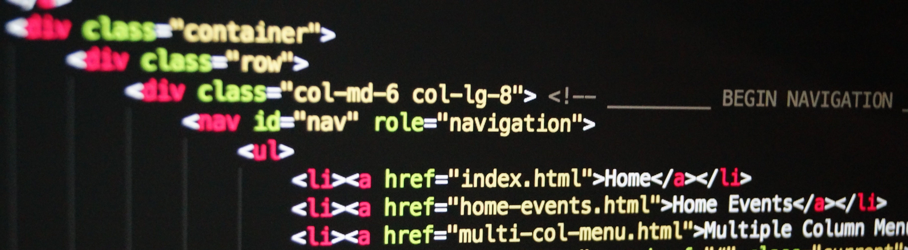

<!--  <!-- I don't know why this doesn't work and it sucks -->
 <!-- I'm not going to waste all my time on a banner. All the good ones needed iStock. And the video I took just doesn't work... -->

## About me
I'm Ehren, a Software Developer student at MITT. And I am passionate about creating webpages and games from the ground up.

I have experience programming in JavaScript, Java, C# and C++ but when making games, I prefer coding in JavaScript and C++ for their different things they have to offer. I want to learn assembly languages in the future so that I can truely build a game from nothing.

My website (work in progress): https://ehren-strifling.github.io/

<!-- ## My skills <!-- I feel bad for copying this since I don't even know how these images work --><!--

  &nbsp;
  &nbsp;
  &nbsp;
  &nbsp;
  &nbsp;

 -->

## My projects
#### xander-js-3
The 3rd iteration of my JavaScript game library, used for code shared across all of my javascript games.  
https://github.com/ehren-strifling/xander-js-3

#### wizard-js-remake
A JavaScript remake of the wizard game I created in Java. Currently my main project using xander-js-3. I want to develop this project to something I can consider a finished game.  
https://github.com/ehren-strifling/wizard-js-remake

## <!-- I am definitely going to copy this though -->

